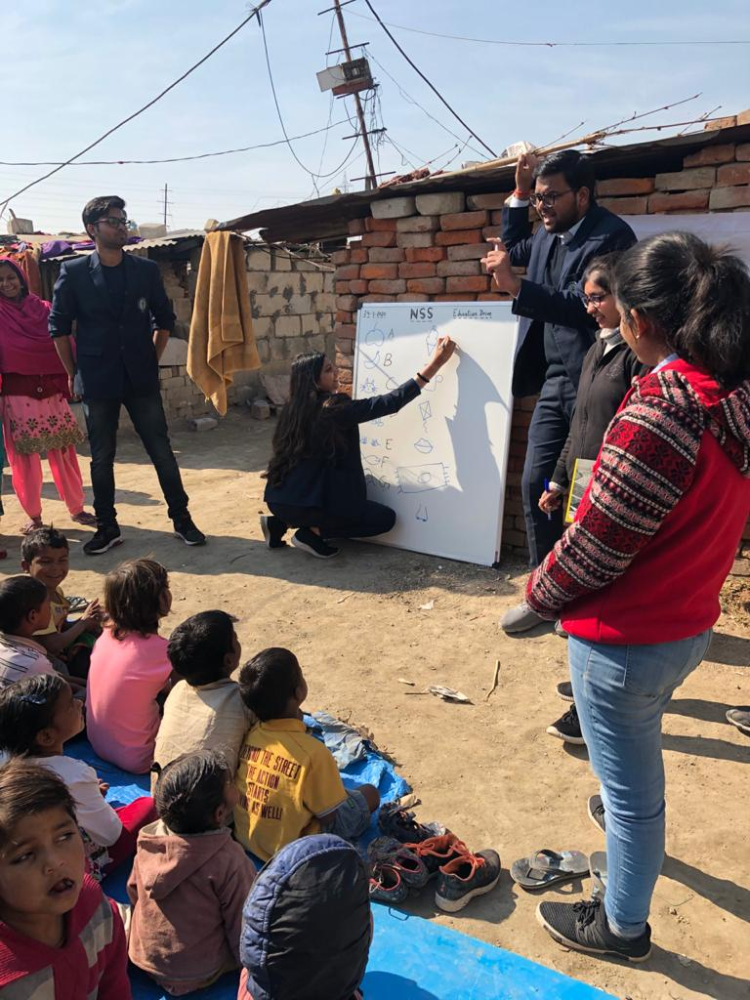

  * Organized and managed blood donation camps, marathons, and plantation drives.
  * Led educational initiatives, designed curricula, and participated in community projects, including food distribution and cleanliness drives.

)
